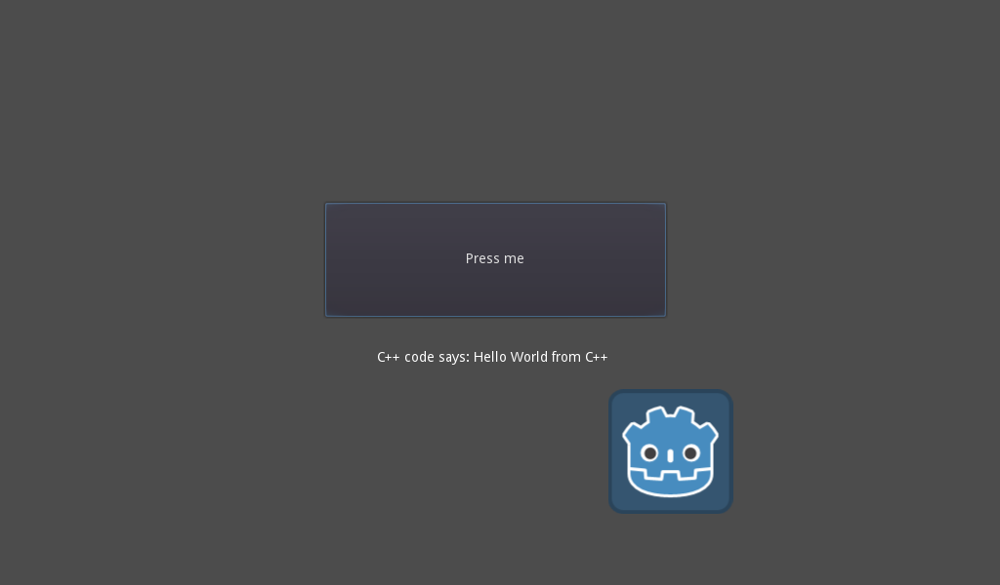

# Simple GDNative C++ demo

This is a small example using C++ to create a GDNative script
that just showcases some very simple bare bones calls.

Language: [GDNative C++](https://docs.godotengine.org/en/latest/tutorials/scripting/gdnative/index.html)

Renderer: GLES 2

Dependencies:
 * You need [godot-cpp](https://github.com/godotengine/godot-cpp),
   this is now a Git submodule of this repo.
 * `clang`, `gcc`, or any decent C++ compiler that's C++14 compatible.

## Compiling

You can use SCons to compile the library:

```
scons platform=PLATFORM
```

Where PLATFORM is: `windows`, `linux`, or `osx`.

This creates the file `libsimple` in the respective
subfolders in the `project/gdnative` directory.

## Screenshots


